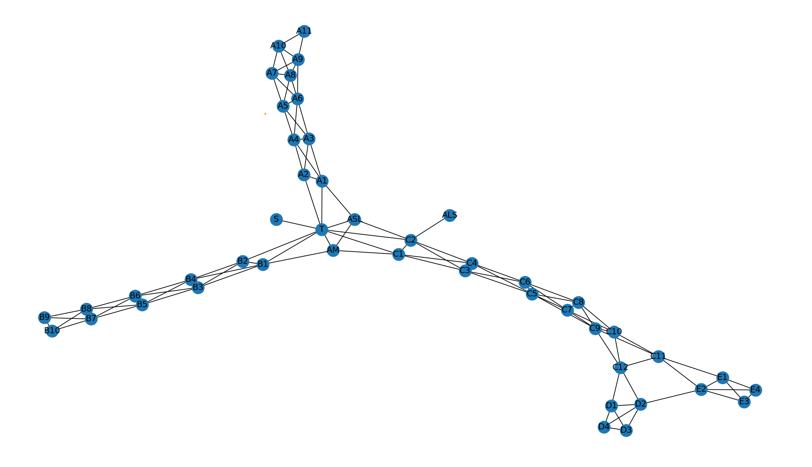

# Transportation Building Exploration

**CISC320 Spring 2023 Lesson 14 - Graph Applications**

Group Members:
* Maxwell Wang (maxwang@udel.edu)
* Thomas Ashfield (tomash@udel.edu )
* Ethan Orevillo (eorev@udel.edu )
* Nicholas DiGirolamo (nickdigi@udel.edu )


## Installation Code

```sh
$> pip install networkx
```

## Python Environment Setup

```python
import networkx as nx
import matplotlib.pyplot as plt
```

# Hamad Airport Terminal Traversal

**Doha Airport Terminal Traversal**: 
An airport geek wants to explore the entire airport of Doha. Currently, the airport
has 41 gates with airline lounges. Given the airport map which is listed as an undirected graph, lets make a Depth-First
Search Traversal of the airport to visit every gate or lounge. For example you are allowed
to visit the terminal **after** you clear security (Node **S**).
> **Formal Description**:
>  * Input: An undirected graph of the airport terminal consisting of gates and lounges
>  * Output: A list of all the gates and the lounges visited within the terminal!

**Graph Problem/Algorithm**: [DFS]


**Setup code**:

```python
import networkx as nx
import matplotlib.pyplot as plt
Airport_Areas = {
        "S": ["T"],
        "T": ["ASL", "AM", "A1", "A2", "B1", "B2", "C1", "C2"],
        "ASL": ["A1", "C2", "AM", "T"],
        "AM": ["ASL", "B1", "C1", "T"],
        "A1": ["A2", "A3", "A4", "ASL", "T"],
        "A2": ["A1", "A3", "A4", "T"],
        "A3": ["A1", "A2", "A4", "A5", "A6"],
        "A4": ["A2", "A3", "A5", "A6"],
        "A5": ["A3", "A4", "A6", "A7", "A8"],
        "A6": ["A3", "A4", "A5", "A7", "A8", "A9"],
        "A7": ["A5", "A6", "A8", "A9", "A10"],
        "A8": ["A5", "A6", "A7", "A9", "A10"],
        "A9": ["A7", "A8", "A10", "A11"],
        "A10": ["A7", "A8", "A9", "A11"],
        "A11": ["A9", "A10"],
        "B1": ["T", "AM", "B2", "B3", "B4"],
        "B2": ["T", "B1", "B3", "B4"],
        "B3": ["B1", "B2", "B4", "B5", "B6"],
        "B4": ["B1", "B2", "B3", "B5", "B6"],
        "B5": ["B3", "B4", "B6", "B7", "B8"],
        "B6": ["B3", "B4", "B5", "B7", "B8"],
        "B7": ["B5", "B6", "B8", "B9", "B10"],
        "B8": ["B5", "B6", "B7", "B9", "B10"],
        "B9": ["B8", "B7", "B10"],
        "B10": ["B9", "B8", "B7"],
        "C1": ["T", "AM", "C2", "C3", "C4"],
        "C2": ["T", "ALS", "C1", "C3", "C4"],
        "C3": ["C1", "C2", "C4", "C5", "C6"],
        "C4": ["C1", "C2", "C3", "C5", "C6"],
        "C5": ["C3", "C4", "C6", "C7", "C9"],
        "C6": ["C3", "C4", "C5", "C7", "C8"],
        "C7": ["C5", "C6", "C8", "C9", "C10"],
        "C8": ["C5", "C6", "C7", "C9", "C10"],
        "C9": ["C7", "C8", "C10", "C11", "C12"],
        "C10": ["C7", "C8", "C9", "C11", "C12"],
        "C11": ["C9", "C10", "C12", "E1", "E2"],
        "C12": ["C9", "C10", "C11", "D1", "D2"],
        "D1": ["C12", "D2", "D3", "D4"],
        "D2": ["C12", "D1", "D3", "D4", "E2"],
        "D3": ["D1", "D2", "D4"],
        "D4": ["D1", "D2", "D3"],
        "E1": ["C11", "E2", "E3", "E4"],
        "E2": ["D2", "E1", "E3", "E4"],
        "E3": ["E1", "E2", "E4"],
        "E4": ["E1", "E2", "E3"]
    }
StartLocation = "S"
G = nx.Graph(Airport_Areas)
nx.draw_spring(G, with_labels=True)
plt.show()
airportDFS()
```

**Visualization**:



**Solution code:**

```python
def airportDFS():
    VisitedAirportArea = {node: False for node in G.nodes}
    ListOfGates = [StartLocation]
    GatesTraversed = []
    while ListOfGates:
        current_gates = ListOfGates.pop()
        if not VisitedAirportArea[current_gates]:
            GatesTraversed.append(current_gates)
            VisitedAirportArea[current_gates] = True
        for node in G.neighbors(current_gates):
            if not VisitedAirportArea[node]:
                ListOfGates.append(node)
    print("The gates that you traversed is: ", "->".join(GatesTraversed))
```

**Output**

```
 S->T->C2->C4->C6->C8->C10->C12->D2->E2->E4->E3->E1->C11->C9->C7->C5->C3->C1->AM->B1->B4->B6->B8->B10->B9->B7->B5->B3->B2->ASL->A1->A4->A6->A9->A11->A10->A8->A7->A5->A3->A2->D4->D3->D1->ALS
```

**Interpretation of Results**:
Based on our results, the airport geek starts
from security and visits the terminal. We then visit Concourse C and visit the even gates
C2, C4, C6, C8, C10. Once we get to concourse D, We visit D2 and then move on to node E2 and visit 
the remaining gates in Concourse E. Then we visit the odd gates in Concourse C,
visit the Al-Mourjain Lounge (node AM) and visit all Concourse B,
The First Class Al-Saffaya Lounge (node ASL), all concourse A, visits the remaining
gates D1, D3 and D4 and ends in style in the Al-Saffya First class lounge

 **Shortest Netowrk Path for Transporting Packets**: 
A network security team would like to know the shortest path to transport packets from a starting router
to a target router.  The team is presented with a network of 25 routers with arbitrary speeds between them.
The routers are represented by a undirected weighted graph with the routers as nodes and the speeds as edges.
In order to assess the fastest path from starting router to target router, the team will use Dijkstra's algorithm.
The team will use the following code to determine the fastest path from the starting router to the target router.
> **Formal Description**:
>  * Input: A weighted undirected graph with the routers as nodes and the speeds as edges.
>  * Output: The fastest path from the starting router to the target router.

**Code**:

```python
import networkx as nx
import matplotlib.pyplot as plt
import random

G = nx.Graph()

# 25 routers with 5 routers connected to each router

routers = {
    "R1": ["R2", "R3", "R4", "R5", "R6", "R7"],
    "R2": ["R1", "R3", "R4", "R7", "R8", "R9"],
    "R3": ["R1", "R2", "R4", "R10", "R11", "R12"],
    "R4": ["R1", "R2", "R3", "R5", "R13", "R14"],
    "R5": ["R1", "R4", "R6", "R13", "R15", "R16"],
    "R6": ["R1", "R5", "R17", "R18"],
    "R7": ["R8", "R9", "R10", "R11", "R12", "R2", "R1"],
    "R8": ["R7", "R9", "R10", "R19", "R20", "R21"],
    "R9": ["R7", "R8", "R10", "R22", "R23", "R24"],
    "R10": ["R7", "R8", "R9", "R11", "R3"],
    "R11": ["R7", "R10", "R12", "R19", "R3"],
    "R12": ["R7", "R11", "R3"],
    "R13": ["R14", "R15", "R16", "R17", "R18", "R5", "R4"],
    "R14": ["R13", "R15", "R16", "R22", "R23", "R24", "R4"],
    "R15": ["R13", "R14", "R16", "R25", "R5"],
    "R16": ["R13", "R14", "R15", "R17", "R5"],
    "R17": ["R13", "R16", "R18", "R6"],
    "R18": ["R13", "R17", "R6"],
    "R19": ["R20", "R21", "R22", "R23", "R24", "R11", "R8"],
    "R20": ["R19", "R21", "R22", "R25", "R8"],
    "R21": ["R19", "R20", "R22", "R8"],
    "R22": ["R19", "R20", "R21", "R23", "R9", "R14"],
    "R23": ["R19", "R22", "R24", "R25", "R9", "R14"],
    "R24": ["R19", "R23", "R9", "R14"],
    "R25": ["R23", "R7", "R8", "R9", "R15", "R20"],
}


# each router has a connection to 5 other routers with different weights
router_edges = []

for source, destinations in routers.items():
    for destination in destinations:
        weight = random.randint(1, 10)
        edge = (source, destination, weight)
        if (destination, source, weight) not in router_edges:
            router_edges.append(edge)

G.add_nodes_from(routers)
G.add_weighted_edges_from(router_edges)
pos=nx.shell_layou(G)
nx.draw(G, pos, with_labels=True, font_weight='bold')
edge_weight = nx.get_edge_attributes(G,'weight')
nx.draw_networkx_edge_labels(G, pos, edge_labels = edge_weight)
plt.show()
```

**Visualization**:


**Solution code:**

```python
print("Path: ", nx.dijkstra_path(G, "R4", "R25"), "Distance: ", nx.dijkstra_path_length(G, "R4", "R25"))
```

**Output**

```
Path:  ['R4', 'R2', 'R9', 'R25'] Distance:  8
```

**Interpretation of Results**:
Based on our results, the network security team starts from router R4 and visits router R2, R9 and R25.
The total distance traveled is 8.